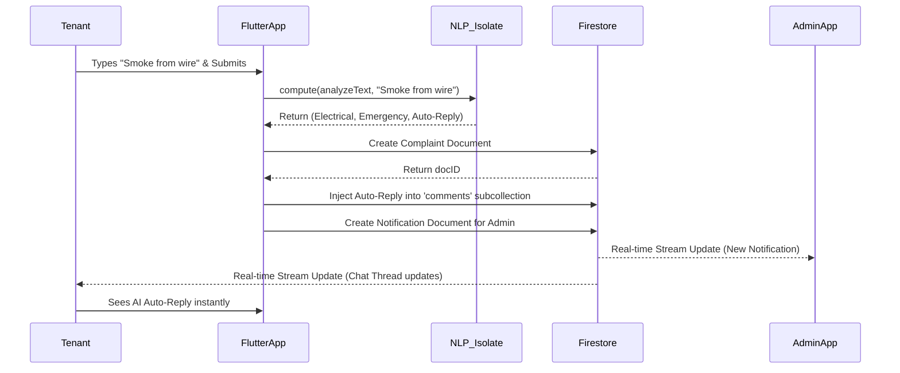

# Complete System Documentation & Architecture Report

## 1. Project Overview
The Smart Apartment Management System is a comprehensive, multi-tenant SaaS application built using Flutter and Firebase. It provides three tailored interfaces (Admin, Member, Guard) connected to a unified real-time cloud database.

---

## 2. Project Structure & Directory Layout
The project follows a modular, feature-based architecture pattern.

```text
lib/
├── core/                  # Core App Configurations
│   ├── router.dart        # GoRouter configuration for deep linking and navigation
│   ├── theme.dart         # Global app styling and color tokens
│   └── saas_config.dart   # Global SaaS parameters
├── features/              # Feature Modules (Role-based UI)
│   ├── admin/             # Admin Dashboard, user management, billing oversight
│   ├── guard/             # Security interface for visitor logging
│   ├── member/            # Tenant interface for complaints and payments
│   ├── auth/              # Login, Signup, and Routing guards
│   ├── notifications/     # In-app notification center UI
│   └── profile/           # User profile and settings
├── shared/                # Shared Business Logic & Reusable Code
│   ├── models/            # Data structures (User, Visitor, Complaint, etc.)
│   ├── screens/           # UI screens used by multiple roles (e.g. Complaint Details)
│   ├── services/          # Core Business Logic (Firestore, Auth, NLP, Auditing)
│   ├── utils/             # Helper functions, formatters, and validators
│   └── widgets/           # Reusable UI components (Buttons, TextFields, Modals)
└── main.dart              # App entry point & initialization
```

---

## 3. Core Modules & Examples

### Module 1: Authentication & RBAC (Role-Based Access Control)
* **What it does:** Authenticates users and routes them to completely different app experiences based on their `role` (admin, member, guard). It also blocks deactivated accounts.
* **Example:** A user logs in. The `AuthService` reads their profile. If `role == 'guard'`, they are instantly routed to the Guard Dashboard and cannot access billing screens.

### Module 2: AI NLP Triage Engine (Complaints Module)
* **What it does:** Analyzes tenant complaint descriptions in real-time on a background thread to assign urgency and categories automatically.
* **Example:** A tenant submits: "There is a spark in the electrical wire!" The NLP Engine instantly categorizes it as `Electrical` and `Emergency`, and posts an AI Auto-Reply in the chat: *"Please do not touch the area. Turn off the main breaker."*

### Module 3: Visitor & Gate Management (Guard Module)
* **What it does:** Allows guards to log walk-in visitors and check-in pre-approved expected guests. Master guards see all wings, while sub-guards are isolated to their specific wing.
* **Example:** A delivery driver arrives. The guard taps "Walk In", enters "Amazon", selects "Flat A-101", and submits. Tenant A-101 immediately receives a notification on their phone.

### Module 4: Automated Billing & Ledger (Admin & Member Module)
* **What it does:** Tracks financial transactions and service request costs.
* **Example:** A tenant books "Deep Cleaning". The Admin completes the job. The `AutomatedBillingDaemon` instantly generates a charge of $50 on the tenant's ledger and marks it as pending payment.

### Module 5: System Audit Engine
* **What it does:** Creates an invisible, immutable record of every critical action in the system for security purposes.
* **Example:** An admin deletes a user. The Audit Engine secretly writes a log to the database: *"[BUILDING_DELETION]: Admin John deleted user profile flat B-202."*

---

## 4. System Diagrams

### 4.1 Use Case Diagram
This diagram maps what each actor (Role) can do within the system.

```mermaid
usecaseDiagram
    actor Admin
    actor Member
    actor Guard

    package "Smart Apartment System" {
        usecase "Manage Users & Wings" as UC1
        usecase "Broadcast Notices" as UC2
        usecase "Approve Service Requests" as UC3
        usecase "View Audit Logs" as UC4
        
        usecase "Raise Complaints" as UC5
        usecase "Pre-Approve Visitors" as UC6
        usecase "View Personal Bills" as UC7
        usecase "Chat in Discussion Thread" as UC8
        
        usecase "Log Walk-in Visitors" as UC9
        usecase "Check-in Expected Guests" as UC10
        usecase "Log Exit Times" as UC11
    }

    Admin --> UC1
    Admin --> UC2
    Admin --> UC3
    Admin --> UC4
    Admin --> UC8

    Member --> UC5
    Member --> UC6
    Member --> UC7
    Member --> UC8

    Guard --> UC9
    Guard --> UC10
    Guard --> UC11
```

### 4.2 Sequence Diagram: NLP Complaint Flow
This demonstrates the exact data flow when a tenant raises a complaint that triggers the AI.



---

## 5. Database Architecture (Firestore)
The database uses a NoSQL document-based structure. Every collection strictly requires a `buildingId` for multi-tenant isolation.

### 5.1 Collection: `users`
Stores profile data, roles, and access status.
* `uid` (String, Primary Key)
* `buildingId` (String) - *Isolation key*
* `role` (String) - *'admin', 'member', 'guard'*
* `email`, `name`, `phone`, `flatNo` (Strings)
* `isActive` (Boolean) - *Controls lockout status*

### 5.2 Collection: `complaints`
Stores tenant complaints and issues.
* `id` (String)
* `buildingId` (String)
* `raisedByUid` (String)
* `title`, `description`, `adminNote` (Strings)
* `status` (String) - *'open', 'in_progress', 'resolved'*
* `category`, `urgency` (Strings) - *Auto-filled by NLP*
* `createdAt` (Timestamp)
  * **Subcollection:** `comments` (Stores chat messages and AI auto-replies for the discussion thread).

### 5.3 Collection: `visitors`
Stores gate logs and pre-approvals.
* `id` (String)
* `buildingId` (String)
* `memberUid` (String) - *Tenant expecting the guest*
* `visitorName`, `purpose` (Strings)
* `status` (String) - *'expected', 'entered', 'exited'*
* `entryTime`, `exitTime` (Timestamps)
* `recordedByGuardId` (String)

### 5.4 Collection: `service_requests`
Stores bookings for building services (cleaning, plumbing).
* `id` (String)
* `buildingId` (String)
* `serviceId`, `serviceName` (Strings)
* `memberUid`, `memberName`, `flatNo` (Strings)
* `status` (String) - *'pending', 'in_progress', 'completed'*
* `cost` (Number) - *Injected to ledger upon completion*

### 5.5 Collection: `payments`
Automated financial ledger.
* `id` (String)
* `buildingId` (String)
* `targetUid` (String) - *Who owes the money*
* `amount` (Number)
* `type` (String) - *'service_fee', 'maintenance'*
* `status` (String) - *'pending', 'paid'*

### 5.6 Collection: `audit_logs`
Immutable security tracking ledger.
* `logId` (String)
* `buildingId` (String)
* `userUid`, `userName` (Strings) - *Who performed the action*
* `action` (String) - *e.g., 'USER_DELETION', 'LOGIN_FAILURE'*
* `result` (String) - *'success', 'failure'*
* `details` (String) - *Context of the action*
* `timestamp` (Timestamp)

---

## 7. Additional Technical Specifications

### 7.1 SaaS White-Labelling & Environment Config
The application is designed to be dynamically white-labeled for different management companies without altering the core source code. 
* A `config.json` file sits at the root directory defining the `APP_NAME`, `TAGLINE`, `PRIMARY_COLOR`, and `ALLOW_SELF_SIGNUP` flags.
* **Execution:** `flutter run --dart-define-from-file=config.json` automatically injects these constants into the Dart environment at compile-time via the `SaasConfig` singleton.

### 7.2 Administrative CLI Deployment Toolkit
The system includes a secure backend setup script (`lib/tools/admin_creator.dart`) that developers can use to provision global 'Super Admin' accounts directly against the Firestore database, bypassing standard UI signups for security.
* **Usage:** `flutter run -t lib/tools/admin_creator.dart --dart-define-from-file=config.json`

### 7.3 Advanced Offline Resilience & Caching
The application utilizes Firestore's local persistence layers and the Hive local storage engine to support environments with poor network connectivity (e.g., basement parking structures).
* **Caching Engine:** Guard logs, tenant profiles, and active service requests are cached. If a guard logs a visitor while the tablet drops WiFi, the transaction is securely queued in the local cache and silently syncs to the cloud the millisecond the connection is restored.

### 7.4 Android Target Specialization
To minimize compilation overhead and reduce vulnerability surfaces, iOS and web artifacts have been stripped from the build context. The app is hyper-specialized for Android deployment (tablets for guards, phones for tenants), leveraging Android-specific manifest configurations for deep local notification channels.

---

## 8. Conclusion
The Smart Apartment Management System effectively bridges the operational gap between building administration, security protocols, and tenant satisfaction. By unifying all critical workflows—from automated billing ledgers to AI-driven emergency triage—under a single, secure multi-tenant architecture, the application entirely eliminates the need for fragmented paperwork and disjointed communication channels. The utilization of Firebase's real-time document synchronization ensures that all stakeholders possess an instantaneous, accurate view of the building's operational state, establishing a highly scalable, robust foundation for modern residential management.

## 9. Future Work
To further expand the ecosystem, the following enhancements are prioritized for future developmental phases:
1. **IoT Hardware Integration:** Integration with BLE (Bluetooth Low Energy) and RFID sensors to automate boom-barrier access for registered tenant vehicles, bypassing manual guard logging.
2. **Payment Gateway API Hooks:** Integrating third-party financial processors (e.g., Stripe, Razorpay) directly into the automated ledger, allowing tenants to seamlessly clear monthly maintenance and service request dues natively within the app.
3. **Firebase Cloud Functions (FCM):** Deploying serverless backend triggers to convert Firestore document updates into OS-level Push Notification payloads, enabling lock-screen alerts when the app is fully backgrounded.
4. **Analytics Dashboard:** Constructing a specialized web-based administrative panel tailored for property management firms to visually graph tenant growth, monthly revenue, and average service request resolution times across multiple disparate buildings simultaneously.

## 10. References
1. **Flutter Architecture Framework:** Flutter Documentation (SDK 3.24+). Available at: [https://flutter.dev/docs](https://flutter.dev/docs)
2. **Cloud Firestore Multi-Tenant Security Rules:** Google Firebase Security Rule Specifications. Available at: [https://firebase.google.com/docs/firestore/security/rules-structure](https://firebase.google.com/docs/firestore/security/rules-structure)
3. **Dart Isolate & Multithreading Performance Optimization:** Dart Language Specification (`compute` methods). Available at: [https://dart.dev/language/concurrency](https://dart.dev/language/concurrency)
4. **Mermaid Diagram Syntax:** Official Mermaid.js Documentation. Available at: [https://mermaid.js.org/](https://mermaid.js.org/)
5. **Hive Local Database Implementation:** Hive for Flutter Documentation. Available at: [https://pub.dev/packages/hive](https://pub.dev/packages/hive)
