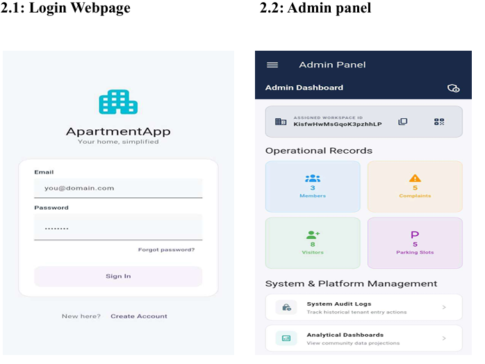
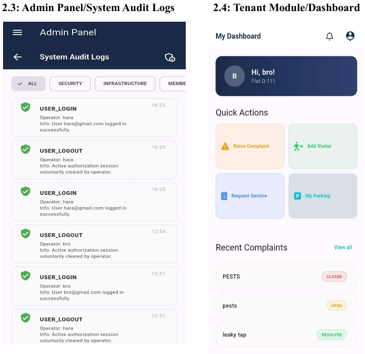
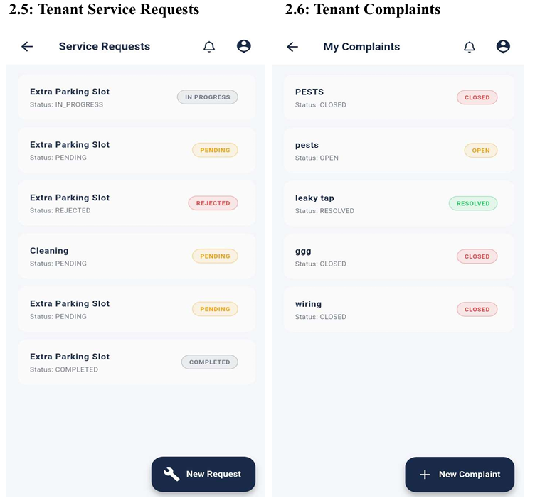
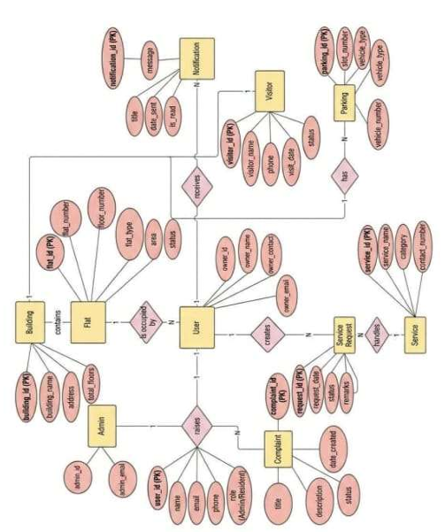

# 🏢 ApartmentApp – SaaS Apartment Management System

A **Flutter + Firebase** based **Apartment Management System (AMS)** designed for **Android** with **multi-building SaaS support**.

The application enables apartment administrators and tenants to efficiently manage apartments, complaints, visitors, parking, service requests, notifications, and resident information through a secure role-based system.

---

## ✨ Features

### 👨‍💼 Administrator

- Dashboard
- Building Management
- Flat Management
- Member Management
- Complaint Management
- Visitor Management
- Parking Management
- Service Management
- Service Requests
- Notifications
- Audit Logs
- Analytics
- Profile Management

### 👨‍👩‍👧 Tenant

- Dashboard
- Raise Complaints
- Service Requests
- Visitor Management
- Parking Details
- Notifications
- Profile Management

---

# 📱 Application Screenshots

## Login & Admin Dashboard

<p align="center">

</p>

---

## Audit Logs & Tenant Dashboard

<p align="center">

</p>

---

## Service Requests & Complaints

<p align="center">

</p>

---

## Database ER Diagram

<p align="center">

</p>

---

# 🚀 Technology Stack

## Frontend

- Flutter
- Dart

## Backend

- Firebase Authentication
- Cloud Firestore
- Firebase Cloud Messaging (FCM)
- Firebase App Check

## Local Storage

- Hive

---

# ⚡ Key Features

### Performance

- Offline Support
- Hive Local Cache
- Firestore Pagination
- Retry Mechanism
- Dashboard Cache
- Shimmer Loading
- Responsive UI

### Security

- Firebase Authentication
- Firebase App Check
- Firestore Security Rules
- Role-Based Access Control
- Secure Token Storage
- HTTPS Enforcement
- Login Lockout Protection

### SaaS Support

- Multi-Building Architecture
- White-label Configuration
- Client-specific Branding
- Remote Configuration

---

# 📂 Project Structure

```text
lib/
├── core/
├── features/
│   ├── admin/
│   ├── auth/
│   ├── guard/
│   └── member/
├── shared/
│   ├── models/
│   ├── services/
│   ├── utils/
│   └── widgets/
└── main.dart
```

---

# 🔥 Firebase Configuration

This repository **does not include Firebase configuration files**.

Each developer or client must configure Firebase using their own Firebase project.

## Step 1

Create a Firebase project.

Enable:

- Firebase Authentication
- Cloud Firestore
- Firebase Cloud Messaging (FCM)
- Firebase App Check

---

## Step 2

Install FlutterFire CLI

```bash
dart pub global activate flutterfire_cli
```

---

## Step 3

Generate Firebase configuration

```bash
flutterfire configure
```

This command generates:

```
lib/firebase_options.dart
```

---

## Step 4

Download

```
google-services.json
```

from Firebase Console and place it inside:

```
android/app/google-services.json
```

---

## Step 5

Install dependencies

```bash
flutter pub get
```

---

## Step 6

Deploy Firestore Rules & Indexes

```bash
firebase deploy --only firestore:rules,firestore:indexes
```

---

# 🔒 Files Not Included

The following files are intentionally excluded because they contain sensitive or project-specific information.

| File | Description |
|------|-------------|
| android/app/google-services.json | Firebase Android configuration |
| lib/firebase_options.dart | Generated using FlutterFire CLI |
| android/key.properties | Android release signing configuration |
| *.jks | Android signing key |
| *.keystore | Android signing key |
| .env | Environment variables |
| serviceAccountKey.json | Firebase Admin SDK credentials |

Generate or provide your own copies before building the application.

---

# 🚀 Installation

Clone the repository

```bash
git clone https://github.com/Harsha-B-CSE/Apartment_Management.git
```

Navigate into the project

```bash
cd Apartment_Management
```

Clean the project

```bash
flutter clean
```

Install dependencies

```bash
flutter pub get
```

Run the application

```bash
flutter run
```

---

# 📦 Build APK

Debug

```bash
flutter build apk --debug
```

Release

```bash
flutter build apk --release
```

---

# ☁️ Firebase Deployment

Deploy Firestore Rules

```bash
firebase deploy --only firestore:rules
```

Deploy Firestore Indexes

```bash
firebase deploy --only firestore:indexes
```

Deploy Everything

```bash
firebase deploy --only firestore:rules,firestore:indexes
```

---

# 🔑 Release Signing

Create:

```
android/key.properties
```

Example:

```properties
storePassword=YOUR_STORE_PASSWORD
keyPassword=YOUR_KEY_PASSWORD
keyAlias=YOUR_KEY_ALIAS
storeFile=../your-keystore.jks
```

> **Never commit** `key.properties`, `.jks`, or `.keystore` files to GitHub.

---

# 🏢 New Client Setup

1. Create a Firebase Project.
2. Download `google-services.json`.
3. Place it in `android/app/`.
4. Run `flutterfire configure`.
5. Edit `assets/config/saas_config.json`.
6. Deploy Firestore Rules & Indexes.
7. Enable Firebase App Check.
8. Create an Administrator account.
9. Build and sign the APK.

---

# 🗄 Firestore Collections

- buildings
- users
- flats
- complaints
- complaint_comments
- visitors
- parking
- services
- service_requests

---

# 🛡 Security

- Firebase Authentication
- Firebase App Check
- Firestore Security Rules
- Role-Based Access Control
- Secure Local Storage
- HTTPS Enforcement
- Login Lockout Protection

---

# 📄 License

This project is developed for educational and demonstration purposes.

---

# 👨‍💻 Author

**Harsha B**

GitHub: https://github.com/Harsha-B-CSE

---

⭐ If you found this project useful, please consider giving it a star on GitHub.
